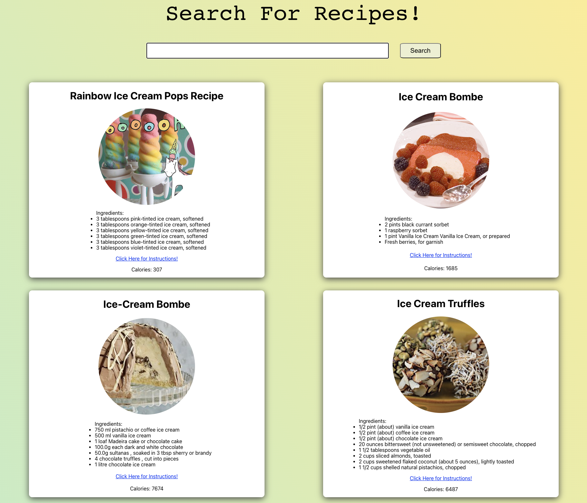
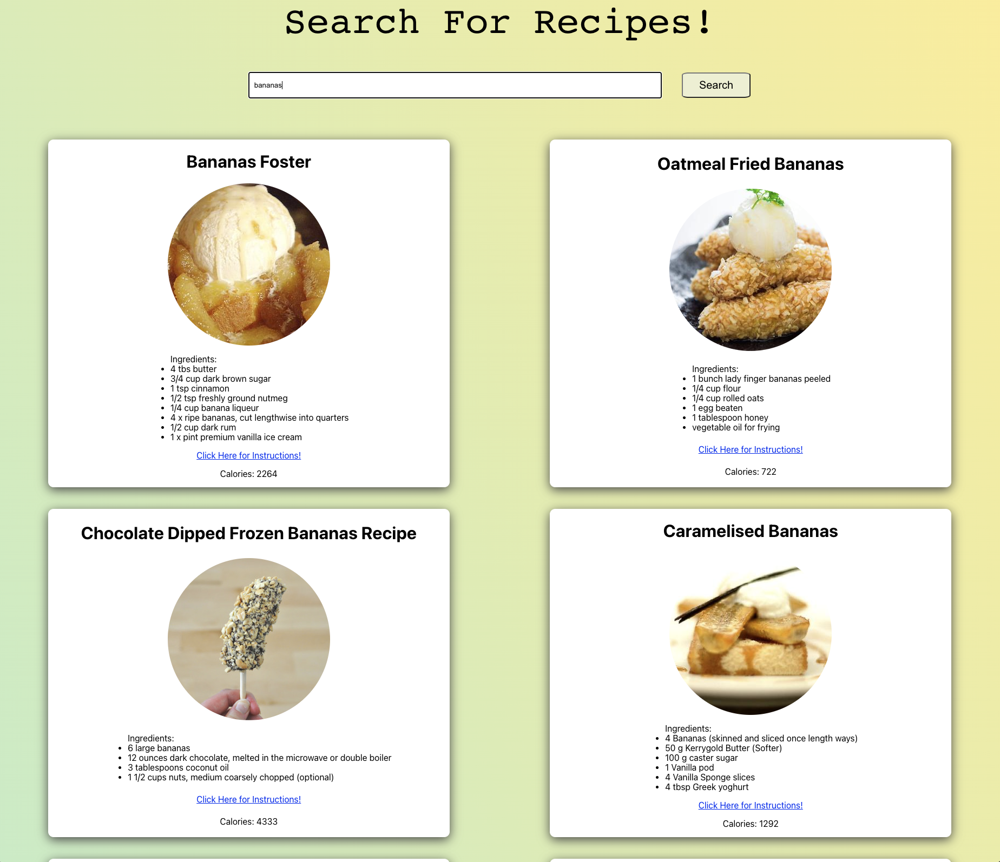
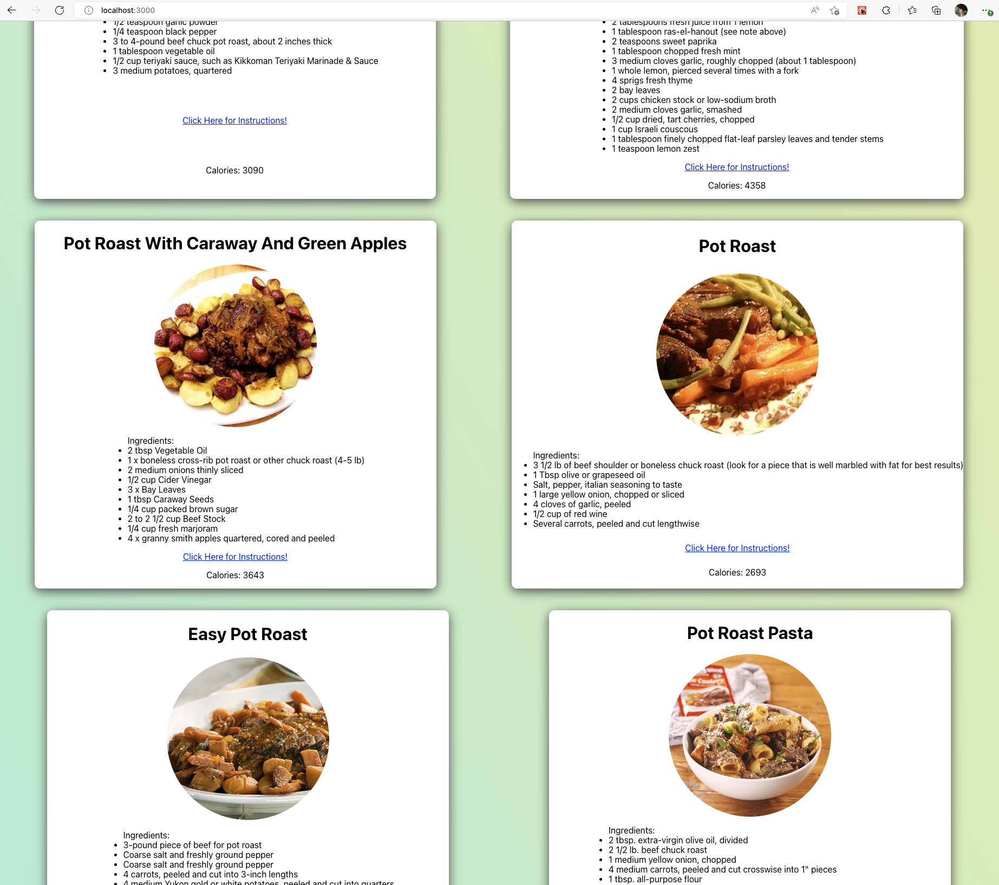

# Recipe App
A simple food recipe app built using React. A user can search for recipes by typing into the search bar and clicking the search button.

Through this project, I learned the following:
- How to fetch data from an api with react
- How useState and useEffect work
- How to pass down data in react with props
- How to style using css

## Tutorial Video Link

https://youtu.be/U9T6YkEDkMo

## Screenshots of Application

